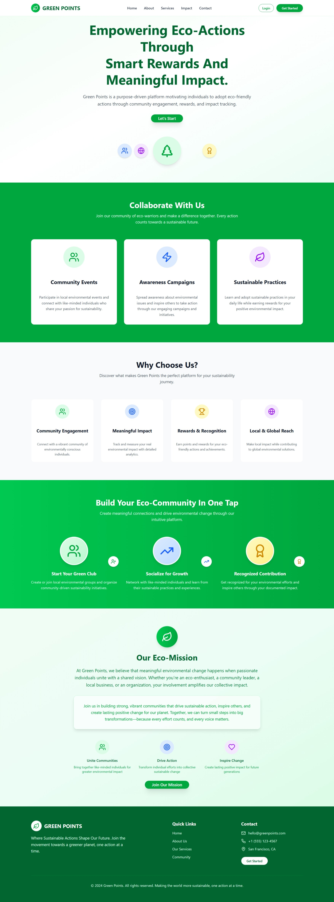
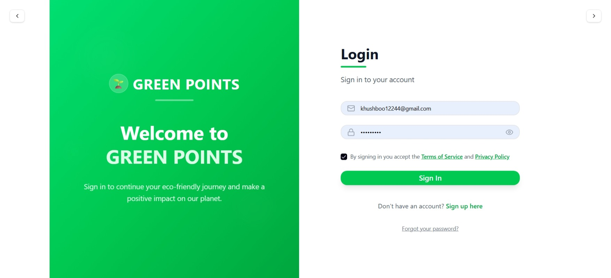
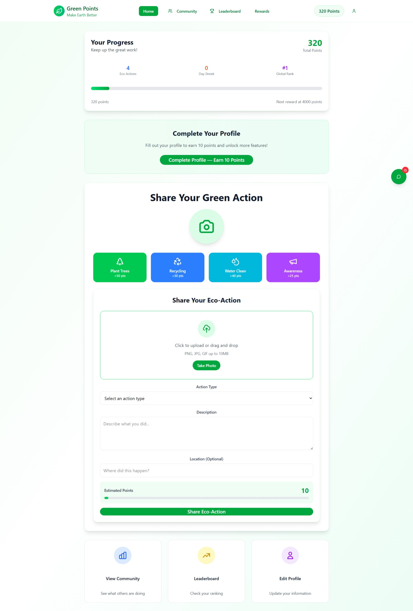
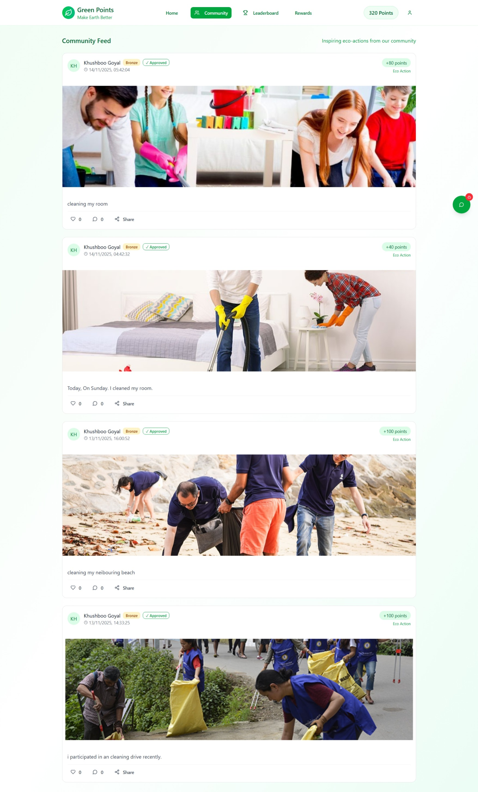
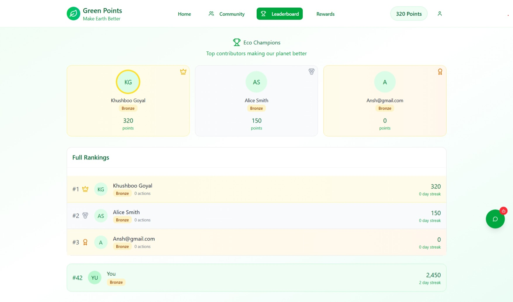
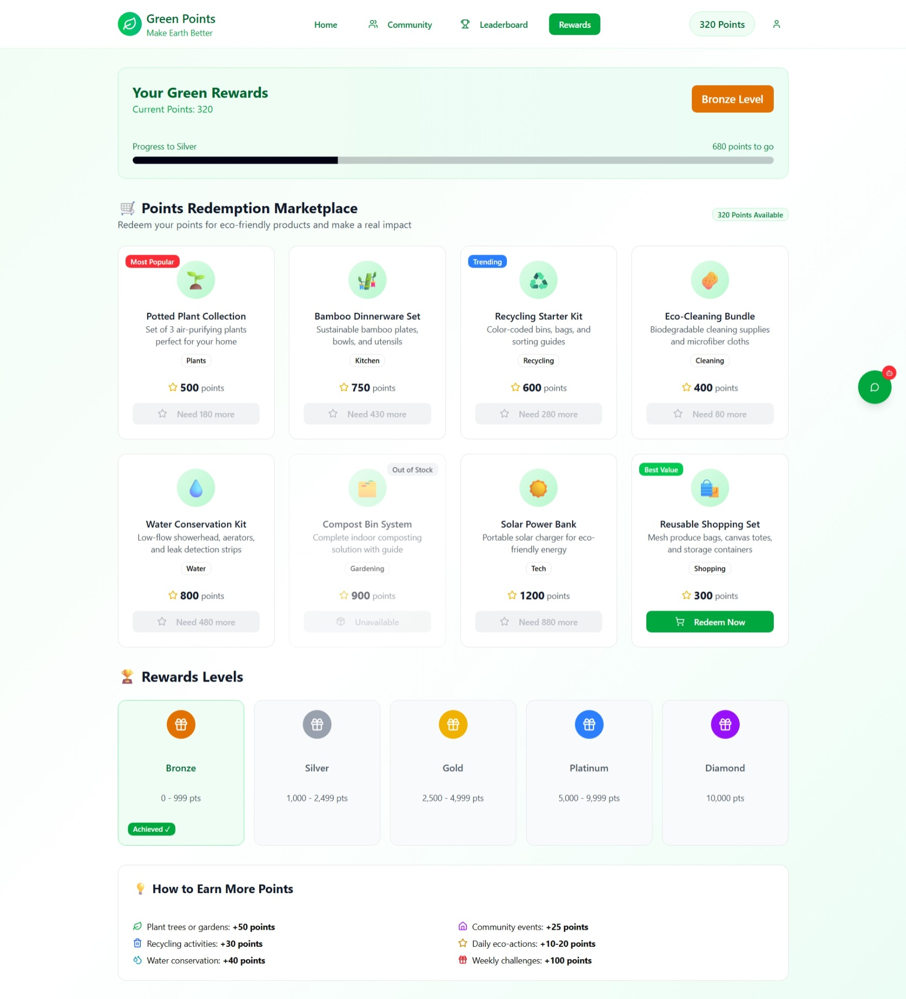
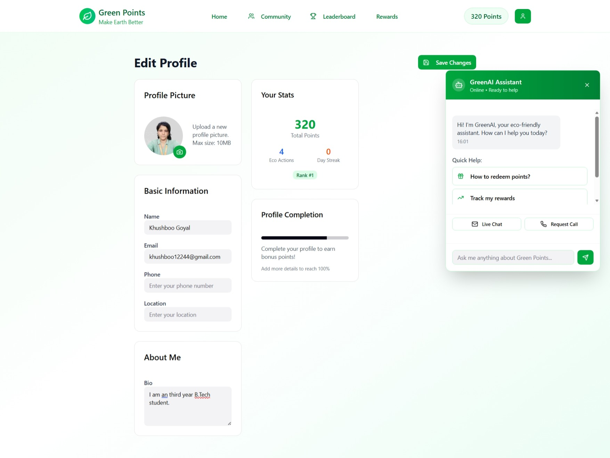

🌱 GreenPoints
Eco-Reward Platform for Sustainable Community Action

  
     

GreenPoints is a sustainability-focused reward platform where users earn points for performing eco-friendly actions. By sharing verified proof of activities—such as recycling, planting trees, water conservation, or community cleanups—users earn reward points and become part of a growing eco-community.

This project blends modern UI/UX, gamified rewards, and real-world environmental impact.

🎨 UI/UX Showcase

## 🔐 Login & Onboarding

## 🏡 Home Dashboard

## 💚 Share Eco-Action

## 👤 Profile Page

## 🎁 Rewards Marketplace

## 🏆 Leaderboard

## 💬 Community Feed

## 📊 Dashboard / Progress

✨ Features

📸 Upload eco-actions with image + description

🔍 Admin / automated verification

🎖️ Points & reward system

🏆 Leaderboard & recognition

👤 Detailed user profile

🔐 Secure authentication

📊 Activity dashboard

🛒 Eco-friendly rewards marketplace

🛠️ Tech Stack

  

    

📂 Project Structure
GreenPoints/
│
├── backend/
│   ├── app.py
│   ├── models.py
│   ├── requirements.txt
│
├── frontend/
│   ├── src/
│   ├── index.html
│   ├── package.json
│   ├── package-lock.json

⚙️ Installation & Setup
▶️ Frontend
npm install
npm run dev

▶️ Backend
pip install -r requirements.txt
python app.py

🌍 How It Works

Register & complete profile

Perform eco-friendly activity

Upload image + description

Verification by admin

Points awarded → leaderboard update

Users get monthly recognition 🎉

🔏 Intellectual Property Notice

This project and its concept are original creations.
🚫 Unauthorized copying, stealing, or recreating the idea is prohibited.
🤝 Collaboration and contributions are welcome.

🤝 Contributing

Contributions are appreciated!
To contribute:

Fork → Create Branch → Commit → Push → Pull Request

📄 License

MIT License — Use responsibly.

👩‍💻 Author

Khushboo Goyal
Developer • Innovator • Sustainability Advocate

   

